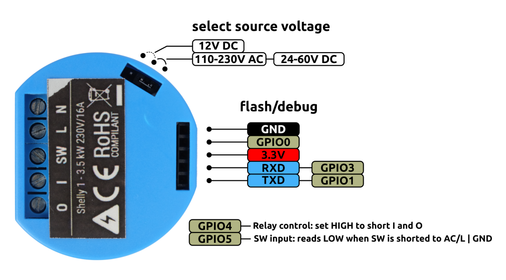

Compiling and flashing the firware

- Install epshome following the guide here https://esphome.io/guides/installing_esphome.html
- Compile the firmware by running
  `esphome compile garagedoor.yaml`
  Result of the compilation is under `.esphome/build/garagedoor/.pioenvs/garagedoor/`
- Backup old firmware:
  `esptool.py --port /dev/tty.usbserial-0001 read_flash 0x00000 0x100000 old_firmware.bin`
- Flash the firmware using esptool:
  `esptool.py --port /dev/tty.usbserial-0001 write_flash -fs 1MB -fm dout 0x0 firmware.bin`

